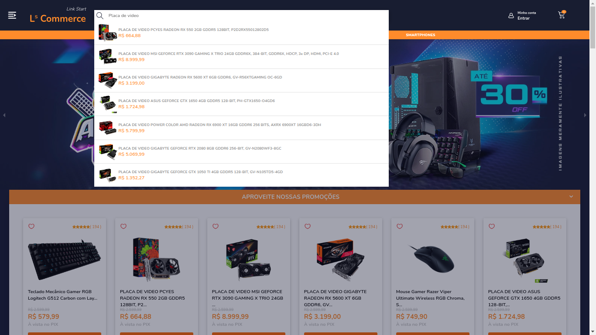
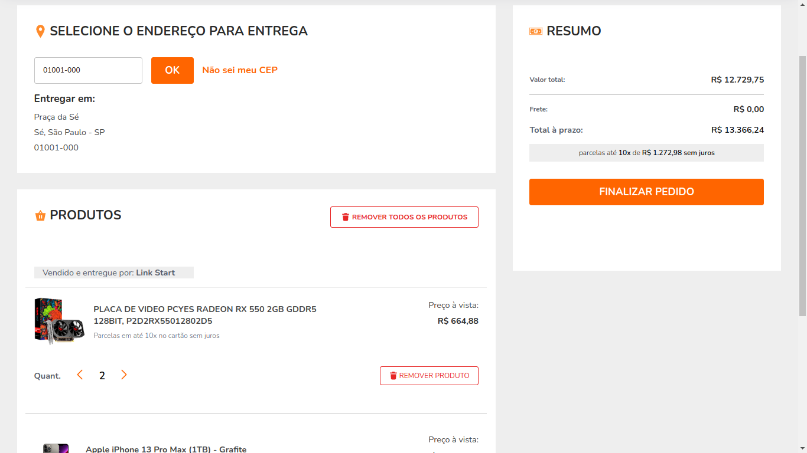
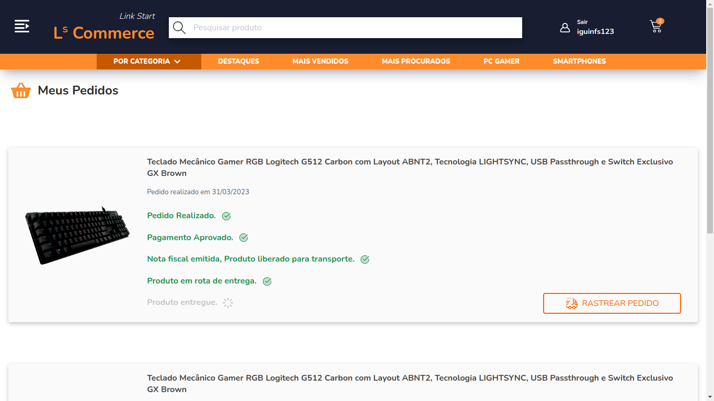
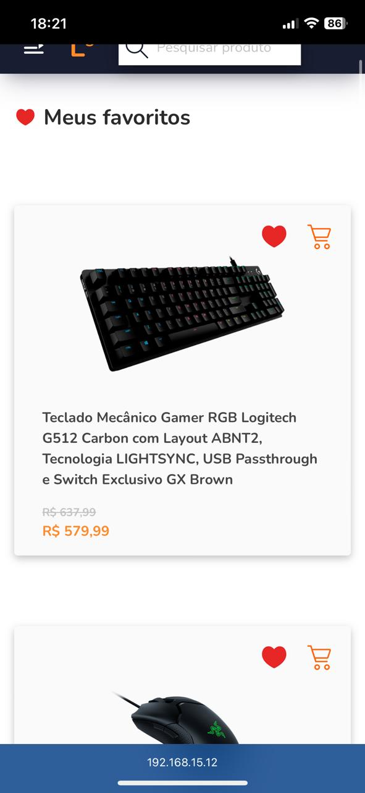

# Link Start | Commerce

<p>
	Link start | Commerce é um projeto e-commerce feito para portfólio, sendo inteiramente desenvolvido por mim <strong>Igor Figueiredo.</strong>
	Este projeto se inspira em grandes e-commerce atuais que tem como foco vendas de produtos eletrônicos e peças de computadores.
</p>
<br>
<br>

<h2> Tecnologias utilizadas: </h2>


<h2>  Como testar a aplicação? </h2>

- Após instalaras tecnologias utilizadas neste projeto em sua máquina, faça o clone do projeto:

```git
	$ git clone https://github.com/igorfig/e-commerce.git
```

- Crie um database PostgreSQL utilizando Docker com todas as tabelas do schema.sql;

- Adicione o JSON de produtos que está dentro de backend/database/productsSchema.json;

- Em sua máquina inicie o servidor:

```zsh 
	$ yarn dev
	$ node src/database/index
```

Também inicie a aplicação front-end:

```zsh 
	$ yarn start
```

Após isso, certamente a aplicação estará disponível para testes.


## Algumas imagens do projeto em sua versão final:

- Página inicial da aplicação, onde mostra todos os produtos, produtos por sessão e algumas ações que o usuário pode executar:

<br>




<br>
<br>
<br>

- Página de carrinho, onde o usuário pode adicionar seus produtos para compra:

<br>




<br>
<br>
<br>

- Página de pedidos, onde o usuário autenticado pode ver os pedidos que foram feitos:

<br>



<br>
<br>
<br>

- Página de login responsiva em um smartphone:

<br>


<br>
<br>
<br>

- Página com os produtos adicionados aos favoritos pelo usuário que está autenticado:

<br>



<br>
<br>
<br>
<br>

<h2> O que há no projeto? </h2>

<p>
O projeto possui uma página Home "/", no qual possui a apresentação de todos os produtos e ações que podem ser executadas pelo usuário, como uma barra de pesquisa de produtos, uma sidebar com algumas páginas acessíveis do site e os produtos por sessões.
</p>

<br>

<p>
	Há uma página de carrinho, onde o usuário pode ver os produtos que foram adicionados, e também finalizar seu pedido de compra.
</p>

<br>


<p>
	Neste projeto tem um sistema de autenticação que é usado JWT tokens para validações, também há possibilidades de cadastrar novos usuários.
</p>

<br>

<p>
	Com o usuário autenticado, temos a possibilidade de finalizar pedidos do carrinho e adicionar aos favoritos, cada valor salvo desse é armazenado no banco de dados postgreSQL referenciando o usuário logado.
</p>

<br>

<p>
	Temos uma página que se encontra os produtos em favoritos, que foram adicionados pelo usuário, a página de pedidos que é uma página estática, apenas com estilização. É para essa página que os produtos que tiveram seus pedidos finalizados no carrinho vão.
</p>

<br>

<p>
	Também temos um dropdown menu no header, um carrousel animado com banners sobre a loja, uma página para cada categoria de produtos, como processadores, computadores e etc...
</p>

<p>
	O layout do projeto foi inspirado na kabum, pichau e lojas virtuais desse ramo tech.
</p>

<strong>
	Projeto inteiramente desenvolvido por mim.
</strong>
