# Link Start | Commerce

	Link start | Commerce é um projeto e-commerce feito para portfólio, sendo inteiramente desenvolvido por mim <strong>Igor Figueiredo.</strong>
	Este projeto se inspira em grandes e-commerce atuais que tem como foco vendas de produtos eletrônicos e peças de computadores.

 
 

<h2> Tecnologias utilizadas: </h2>

 
 
## Principais Atualizações
 

26/01/2023 - Primeiro commit: 
 
	* Projeto no ínicio de desenvolvimento.
	 
	* Página Home criada
	 
	* Backend Pré montado
	 

 

28/01/2023:
 
	* Página /login adicionada com ouso do react-router-dom
	 
	* código de estilos refatorados 27/01/2023
 
 

02/02/2023:
 
	* Página /carrinho adicionada, estilizada e responsiva.
 
 

03/02/2023:
 
	* Página /(nome do produto) adicionada, estilizada e responsiva.
	Obs: URLs ainda não estão sendo tratadas corretamente (cada product name é uma rota)
 
 

## Como será o projeto no final do desenvolvimento?
 

	O projeto terá páginas para serem acessadas pelo usuário e uma em específica pro root. Sendo essas as seguintes páginas:
	 
	 
	- <strong>/home</strong> ( Página inicial, onde será mostrado o principal do e-commerce)
	 
	 
	- <strong>/login</strong> ( Página de autenticação. Apenas será feita a autenticação do root, sendo feita através do front-end. Apenas para simulação de um dashboard.)
	 
	 
	- <strong>/carrinho</strong> ( Página com os produtos adicionados no carrinho pelo usuário, os produtos do carrinho serão mantidos salvos no Local Storage do browser.)
	 
	 
	- <strong>/dashboard</strong> (Acessada apenas pelo root da página através de autenticação. Aqui será a página pro root atualizar estoque e outras informações sobre os produtos da "loja")
	 
	 
	- <strong>/produto/processadores</strong> ( Página de produtos que mostrará os produtos por categorias, por exemplo "Processadores".)
	 
	 
	- <strong>/produto/id</strong> ( Página sobre um produto em específico. Aqui irá conter as informações completas do produto.)
	 
	 

 
 

	A parte de produtos, estoque, informações, valores, etc... Será mantida no backend com Express.js por um banco de dados feito em PostgreSQL.
	 
	Todos os produtos e suas informações são recebidos atráves do banco de dados.

 
<strong>PROJETO EM DESENVOLVIMENTO INICIAL</strong> dessa forma pode haver mudanças constantes ao longo do desenvolvimento.
 
 
 

<h2>Algumas imagens do projeto até o último commit de build feito:</h2>
 
 

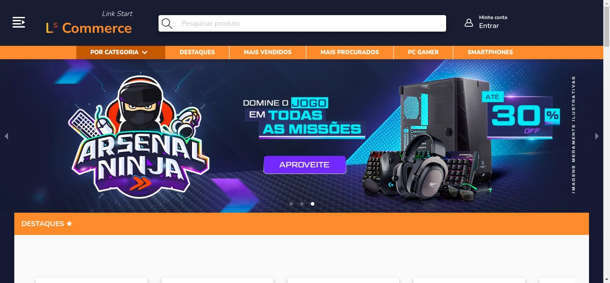
 
 
 

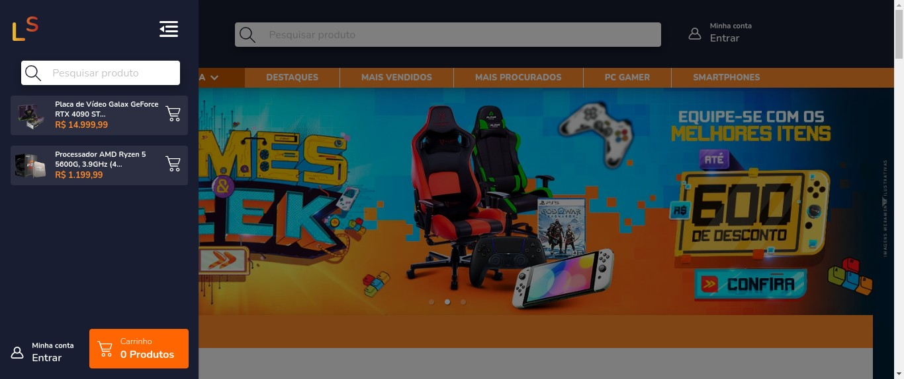
 
 
 

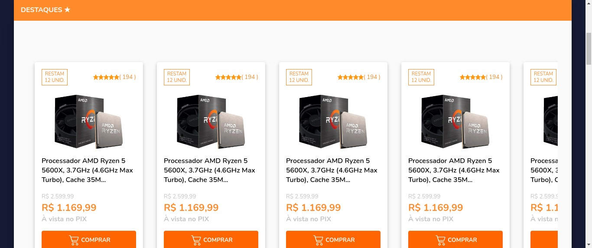
 
 
 

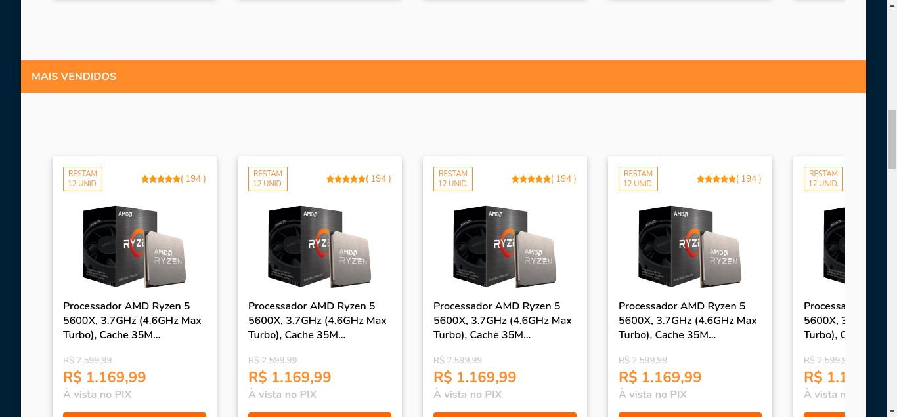
 
 
 

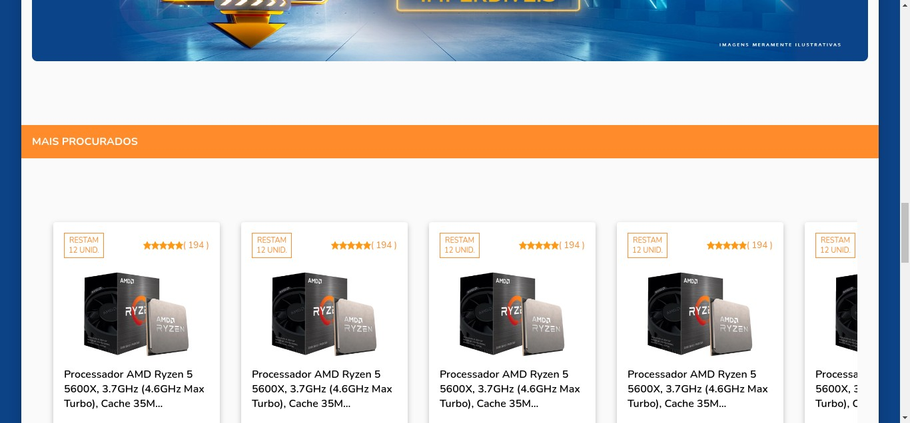
 
 
 

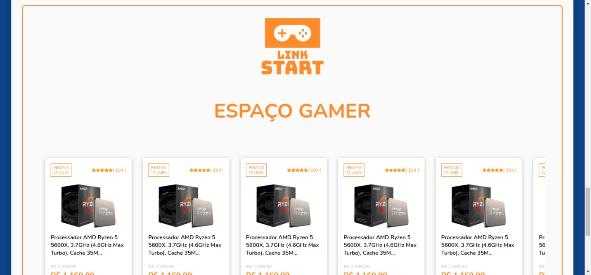
 
 
 

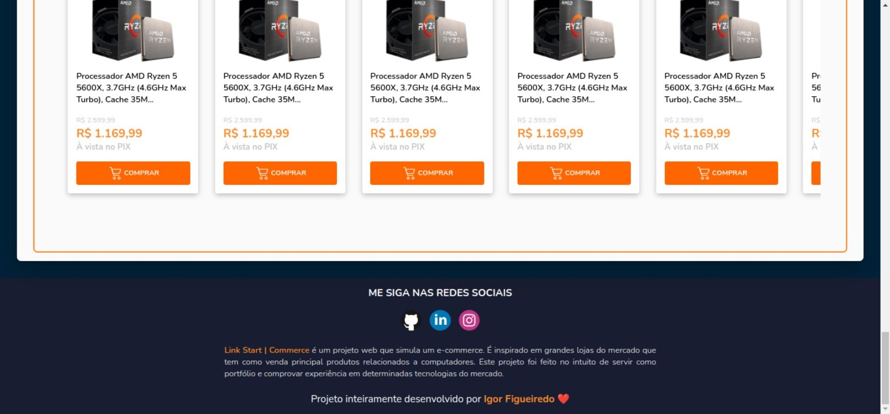
 
 
 

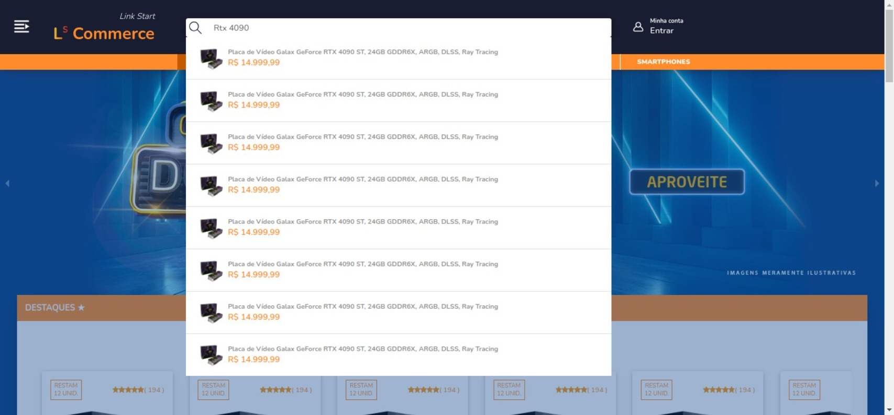
 
 
 

 
 
 

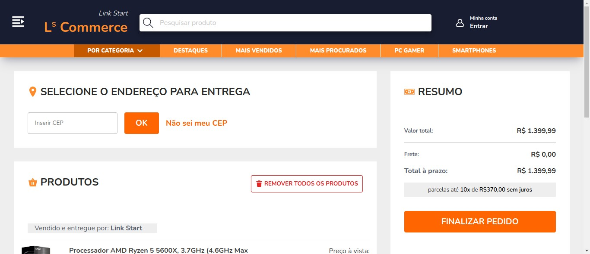
 
 
 

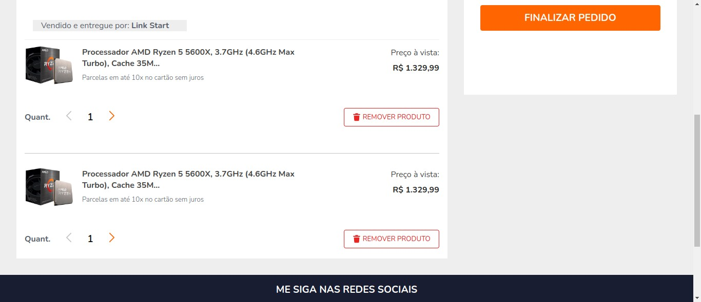

 
 
 

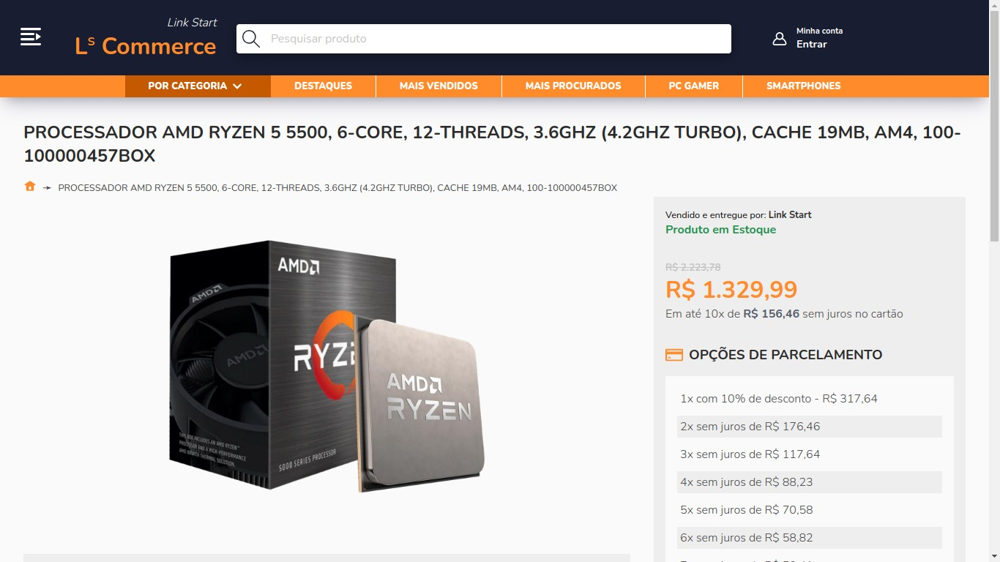

 
 
 

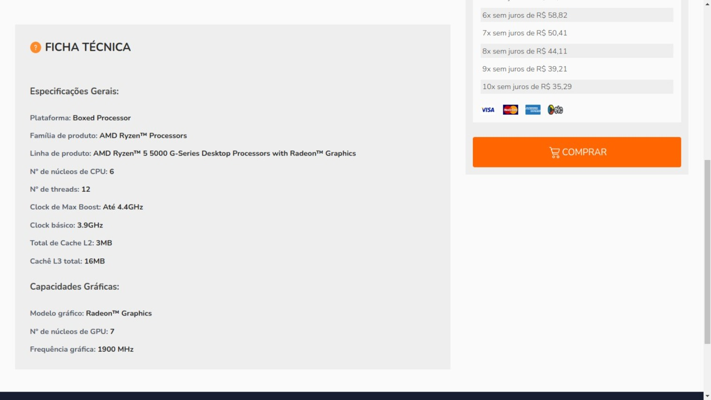

